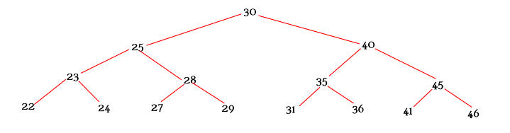
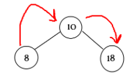
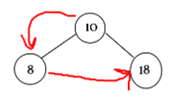
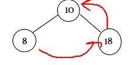
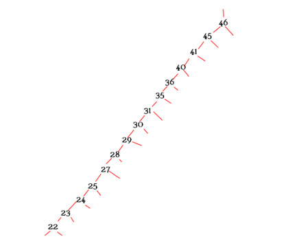
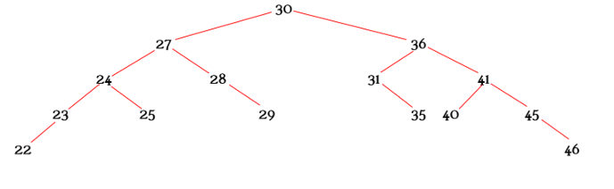
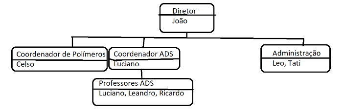

# Árvore

É uma estrutura de dados em que cada pode ter vários filhos e uma raiz principal (o primeiro elemento)

## Árvore Binária

- Uma árvore binária pode ter no máximo dois filhos (sendo um à esquerda ou menor e outro à direito ou maior que o elemento pai) e uma raiz (elemento inicial)

- Dentro de uma árvore binária, existe um ponto em específico que define se ela será muito boa para verificar e percorrer dados de uma forma bem mais otimizada e rápida, que é o balanceamento (que especialmente evita que ela possa se parecer com uma lista dependendo da sequência de elementos que forem adicionados)

- [Árvore Binária sem Balanceamento](./SemAVL/): Possuí funcionalidades mais simples, como adicionar um novo nó na árvore, com a lógica de pecorrer ela até encontrar a posição de maior/menor em um elemento é folha e adicionar o pedido como seu filho, a remoção de um elemento (ue tem diversos fatores envolvidos já que não é só remover.

- Existe uma espécie de reordenação caso o elemento tenha filhos) e a impressão de ordenação de lista simples da árvore (a ordem, pré-ordem e pós-ordem)

- [Árvore Binária com Balanceamento](./ComAVL/): Sendo uma árvore mais justa e uma estrutura de dados que realmente possa ser utilizada em um sistema ou empresa, ela contém balanceamento (ou seja, é uma Árvore AVL ou um tipo de árvore binária de busca que possui a propriedade de autobalanceamento dinâmico). Assim, não importa a sequência que colocarmos os dados, ela reajustará a árvore a cada novo No, mantendo ela minimamente proporcional em níveis dos dois lados (no maior/direito e menor/esquerdo)
- Na primeira imagem abaixo é possível ver como ficaria uma árvore binária com um certo input específico, e por último, o quanto que ela ficaria organizada de uma forma melhor com o balanceamento

## Árvore Não Binária

- Uma árvore não binária não tem limite de quantos filhos um elemento pode ou deve ter (podendo ter de 0 diversos filhos ou mais que 2). Pode soar semelhante, mas uma árvore não binária não é exatamente igual a um Grafo, pela sua qualidade de "elemento raiz" ainda ser semelhante a uma Árvore comum

- [Árvore não Binária](./Organograma): Referente a esse exemplo da Árvore Não Binária, utilizei o de organograma (Existe uma estrutura mais alta com determinadas pessoas que tem conexão com uma mais baixa/filha e a mesma tem outras propriedades e etc.)

  - Atividade do Organograma: O objetivo desta prática é criar um organograma de uma unidade de ensino fictícia, trata-se de um árvore não binária, e cada item da árvore é um grupo/departamento. Dentro de cada grupo/departamento temos uma lista de funcionários e esta lista é ordenada.
  - Então temos que ter uma função que cria um departamento/grupo e vamos exigir um nome, tipo: Administração, Coordenador ADS, etc. Se o pai no nó for NULL então estamos falando da raiz, só pode ser 1 nó raiz, se o segundo tentar ser adicionado eleva um exception. Para adicionar uma pessoa deve-se informar o nome do departamento/grupo e o nome da pessoa. Já para remover, deve-se também informar o nome do departamento/grupo e o nome da pessoa. Em caso de informar um departamento/grupo que não existe, eleve um exception.
  - Para pesquisar, basta passar o nome de uma pessoa, e então o sistema deverá informar o departamento/grupo que aparece aquele nome, no exemplo acima, se pesquisar Luciano deve aparecer:
    - Luciano: Coordenador ADS, Professores ADS

