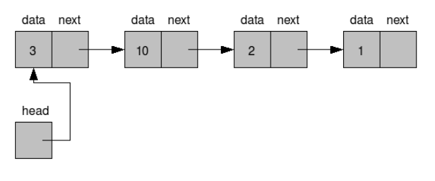
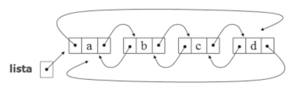
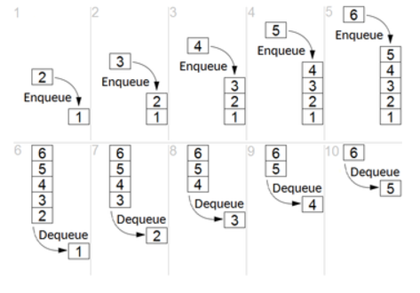
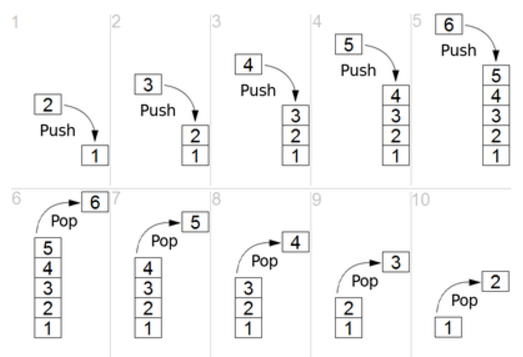

# Lista Encadeada

## Listas Ilimitadas

É um tipo de lista (geralmente as que dão nome as Listas Encadeadas) que contém várias funções, métodos e outras utilidades complemantes livres de serem feitas (get, insert, delete, etc.)

- [Lista Encadeada Simples](./Simples/): É uma estrutura em que, para um Nó se conectar com um outro, existe uma propriedade que é como se fosse um ponteiro que indica o elemento seguinte à ele (o próximo elemento dele) e assim por diante. Contém ações como append (adicionar elemento na última posição da lista), get (coletar índice e ponteiro do elemento pelo nome), index (coletar ponteiro do elemento pelo índice), insert (inserir elemento em determinada posição), last (último elemento da lista), remove (remover elemento) e total (quantidade de elementos na lista)

- [Lista Duplamente Encadeada](./Dupla/): É uma estrutura em que, para um Nó se conectar com um outro, existe uma propriedade que é como se fosse um ponteiro que indica o elemento seguinte e posterior à ele (o próximo elemento dele e anterior à ele) e assim por diante. Contém ações como append (adicionar elemento na última posição da lista), get (coletar índice e ponteiro do elemento pelo nome), insert (inserir elemento em determinada posição), last (último elemento da lista), prepend (adicionar o elemento na primeira posição da lista), remove (remover elemento) e total (quantidade de elementos na lista)

- [Lista Circular Duplamente Encadeada](./Circular/): Uma estrutura que é uma lista dupla. Contudo, ao invés do ponteiro do último ou primeiro elemento (seja anterior o próximo) ser nulo, o anterior do primeiro elemento se conecta com o último e virse-versa (criando a lista como se fosse círculo)

## Listas Limitadas

São Estruturas de Dados indiretamente baseadas na mesma lógica de listas (tem um ponteiro para a frente e/ou atrás, um elemento indicando o final ou início da ED), com restrições especialmente no formato de adição ou remoção de elementos. Por esse tipo de restrição elas contém peculiaridades interessante que fazem elas serem utilizadas em muitos programas essenciais de computadores e que substituem as suas supostas inspirações (Lista Encadeadas) pela sua velocidade e otimização dependendo do seu uso e escopo de execução

- [Fila](./Fila/): Como dito no diretório da disciplina, uma fila é uma FIFO (First In, First Out), uma estrutura de dados de uma lista bem mais restrita, em que um elemento é sempre adicionado da posição do último recente (queue) e o elemento coletado/removido é sempre o primeiro mais recente na fila (enqueue)

- [Pilha](./Pilha/): Stack/Pilha é uma estrutura, que, como a FIFO, o elemento sempre é adicionado no último mais recente (push). Contudo, um elemento removido é sempre o último mais recente (pop). É possível pensar nela como se fosse a pilha de chamadas de funções/procedimentos (ou o clássico erro do "StackOverflow" ou estouro de pilhas)

- <b> Lembrando que todos os arquivos de models (seja nó ou estrutura) dessas estruturas ou de qualquer outra estrutura mais para frente tem um toString para converter o valor em algo possível de ser imprimido ou percorrer todos os valores de elementos da estrutura de dados </b>